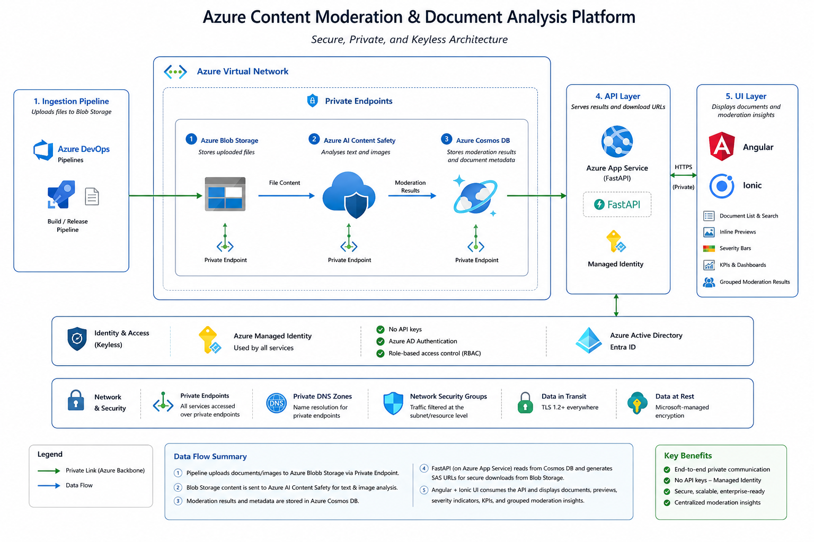

# AI Content Safety POC

Azure AI Content Safety proof-of-concept with generated test documents, private-network processing pipeline, Python FastAPI, and an Ionic + Angular UI.

## Table of Contents

- [Architecture](#architecture)
- [Folder Structure](#folder-structure)
- [Azure Resources](#azure-resources)
- [Content Safety Categories](#content-safety-categories)
- [Confidence Score](#confidence-score)
- [Setup & Configuration](#setup--configuration)
- [Pipeline (Python)](#pipeline-python)
- [REST API (Python / FastAPI)](#rest-api-python--fastapi)
- [UI (Ionic + Angular)](#ui-ionic--angular)
- [GitHub Actions Workflows](#github-actions-workflows)
- [Generated Data](#generated-data)
- [Best Practices](#best-practices)
- [Use Cases](#use-cases)
- [References](#references)
- [License](#license)

---

## Architecture



1. **Pipeline** downloads files from Blob Storage, analyses text + images via Content Safety, stores results in Cosmos DB.
2. **API** (FastAPI on App Service) serves results from Cosmos DB and SAS download URLs from Blob Storage.
3. **UI** (Angular + Ionic) displays documents, inline previews, severity bars, KPIs, and grouped moderation results.

All Azure services communicate over **private endpoints** with **managed identity** (no API keys).

## Folder Structure

```text
.
├── .github/workflows/       # CI/CD — one workflow per component
│   ├── api-deploy.yml        #   API deploy (api/**)
│   ├── pipeline-process.yml  #   Run content safety pipeline (pipeline/**)
│   ├── ui-ci.yml             #   UI build + test on PR (ui/**)
│   └── ui-deploy.yml         #   UI deploy to App Service (ui/**)
├── api/
│   ├── server.py             # FastAPI app
│   └── requirements.txt
├── config/
│   ├── azure-resources.template.json
│   └── pipeline-settings.template.json
├── data/                     # 100 generated test files + manifest
├── docs/
├── pipeline/
│   ├── process_content.py    # Content safety processing pipeline
│   └── requirements.txt
├── scripts/
│   └── regenerate_demo_data.py  # Seed Cosmos DB with varied severities
├── ui/                       # Angular 20 + Ionic 8 SPA
├── upload_to_blob.py         # One-shot blob uploader
├── package.json
└── README.md
```

## Azure Resources

All resources in resource group **ai-myaacoub** (West US 2):

| Resource | Name | Type | Details |
|----------|------|------|---------|
| Blob Storage | aistoragemyaacoub | Storage Account | Container: `content-safety-documents`, private endpoint |
| Cosmos DB | cosmos-ai-poc | NoSQL Database | DB: `contentSafetyDb`, Container: `contentSafetyResults` |
| Content Safety | 002-ai-poc-private | Cognitive Service | API 2024-09-01, private endpoint |
| API | ai-content-safety-api | App Service | Python 3.12, FastAPI + Uvicorn |
| Web App | ai-content-safety-ui | App Service | Angular 20, Ionic 8 |
| Plan | ASP-aimyaacoub-87dc | App Service Plan | B1 Basic |

## Content Safety Categories

Azure AI Content Safety analyses content across four harm categories. Each category returns a **severity score** of 0, 2, 4, or 6.

| Category | Description | Example Triggers |
|----------|-------------|-----------------|
| **Hate** | Content expressing hostility, discrimination, or violence toward individuals based on protected characteristics (race, gender, religion, etc.) | Slurs, dehumanizing language, supremacist rhetoric |
| **SelfHarm** | Content encouraging, glorifying, or providing instructions for self-injury, suicide, or eating disorders | Suicide methods, pro-anorexia content, self-injury encouragement |
| **Sexual** | Sexually explicit or suggestive content inappropriate for general audiences | Graphic sexual descriptions, sexually suggestive content involving minors |
| **Violence** | Content glorifying, promoting, or providing instructions for violent acts | Graphic injury descriptions, weapon-making instructions, threats of violence |

### Severity Levels

| Severity | Level | Meaning |
|----------|-------|---------|
| **0** | Safe | No harmful content detected |
| **2** | Low | Mildly concerning — may be acceptable in adult contexts |
| **4** | Medium | Clearly harmful — blocked by default threshold |
| **6** | High | Severely harmful — always blocked |

The pipeline uses a configurable threshold (default: **4**). Any category at or above the threshold triggers a **blocked** decision.

## Confidence Score

The UI computes a **confidence score** for each document's moderation result:

```
confidence = min(0.5 + maxSeverity / 14, 0.99)
```

| Max Severity | Confidence | Interpretation |
|-------------|------------|----------------|
| 0 | 50% | Low confidence — no signal detected |
| 2 | 64% | Moderate — some signal present |
| 4 | 79% | High — clear harmful content |
| 6 | 93% | Very high — severe harmful content |

The score reflects how strongly the model detected harmful signals. A higher severity yields higher confidence in the moderation decision.

## Setup & Configuration

### 1. Copy config templates

```bash
cp config/azure-resources.template.json config/azure-resources.json
cp config/pipeline-settings.template.json config/pipeline-settings.json
# Edit both files with your real Azure resource values
```

### 2. Authenticate

```bash
# Option A: Azure CLI (development)
az login
az account set --subscription 86b37969-9445-49cf-b03f-d8866235171c

# Option B: Service principal (CI/CD)
export AZURE_TENANT_ID="<tenant>"
export AZURE_CLIENT_ID="<client>"
export AZURE_CLIENT_SECRET="<secret>"
```

### 3. Assign RBAC roles

```bash
CLIENT_ID="<your-client-or-managed-identity-id>"

# Storage Blob Data Contributor
az role assignment create --role "Storage Blob Data Contributor" \
  --assignee "$CLIENT_ID" \
  --scope "/subscriptions/.../Microsoft.Storage/storageAccounts/aistoragemyaacoub"

# Cognitive Services User
az role assignment create --role "Cognitive Services User" \
  --assignee "$CLIENT_ID" \
  --scope "/subscriptions/.../Microsoft.CognitiveServices/accounts/002-ai-poc-private"

# Cosmos DB Built-in Data Contributor
OBJECT_ID=$(az ad sp show --id "$CLIENT_ID" --query id -o tsv)
az cosmosdb sql role assignment create \
  --account-name cosmos-ai-poc --resource-group ai-myaacoub \
  --role-definition-id 00000000-0000-0000-0000-000000000002 \
  --principal-id "$OBJECT_ID" --scope "/"
```

## Pipeline (Python)

### Upload files to Blob Storage

```bash
pip install azure-identity azure-storage-blob
python upload_to_blob.py
```

### Run content safety analysis

```bash
pip install -r pipeline/requirements.txt
python pipeline/process_content.py
```

### Regenerate demo data (varied severities for demo)

```bash
pip install azure-identity azure-cosmos
python scripts/regenerate_demo_data.py
```

This seeds Cosmos DB with ~50 safe, ~25 review, ~25 blocked documents with varied Hate/SelfHarm/Sexual/Violence severity combinations.

## REST API (Python / FastAPI)

The API is deployed to Azure App Service at:

- **Base URL**: https://ai-content-safety-api.azurewebsites.net
- **Swagger UI**: https://ai-content-safety-api.azurewebsites.net/api/swagger
- **OpenAPI Spec**: https://ai-content-safety-api.azurewebsites.net/api/swagger.json

### Endpoints

| Method | Endpoint | Description |
|--------|----------|-------------|
| GET | `/api/health` | Health check — status, endpoints, timestamp |
| GET | `/api/documents` | List all processed documents |
| GET | `/api/documents/{fileName}/download-url` | SAS download URL (valid 15 min) |
| GET | `/api/results` | All results. Filter: `?decision=safe\|blocked` |
| GET | `/api/results/summary` | KPI summary (total, safe, blocked, review, byFormat) |
| GET | `/api/results/{id}` | Single result by document ID |
| GET | `/api/swagger` | Interactive Swagger UI |
| GET | `/api/swagger.json` | OpenAPI 3.0 specification |

### Run locally

```bash
cd api
pip install -r requirements.txt
uvicorn server:app --host 0.0.0.0 --port 8000 --reload
```

### Example Responses

**GET /api/health**
```json
{
  "status": "ok",
  "cosmosEndpoint": "https://cosmos-ai-poc.documents.azure.com:443/",
  "storageEndpoint": "https://aistoragemyaacoub.blob.core.windows.net/",
  "timestamp": "2026-05-14T00:15:00.000Z"
}
```

**GET /api/results/summary**
```json
{
  "total": 100,
  "safe": 50,
  "blocked": 25,
  "review": 25,
  "byFormat": { "png": 20, "jpg": 20, "pdf": 20, "docx": 20, "pptx": 20 }
}
```

## UI (Ionic + Angular)

Deployed at **https://ai-content-safety-ui.azurewebsites.net**

### Documents Page
- Compact two-panel layout: scrollable document list + inline viewer
- Per-file-type viewers: `` for PNG/JPG, `<iframe>` for PDF, Office Online viewer for DOCX/PPTX
- Severity bar visualisation per category (Hate, SelfHarm, Sexual, Violence)
- Process selected / current page / all documents
- Paginated list with format badges and status indicators

### Results & KPI Page
- KPI cards: total, safe, review, blocked counts
- Pie chart distribution + accuracy metric
- Grouped results list (safe / review / blocked)
- Side-by-side document preview + detailed result panel
- Severity bars with colour-coded severity levels

### Responsive Layout
- **Desktop** (>1024px): side-by-side panels
- **Tablet** (768–1024px): narrower sidebar, stacked detail view
- **Mobile** (<768px): fully stacked, compact cards

### Run locally

```bash
cd ui
npm install
ng serve
# Open http://localhost:4200
```

## GitHub Actions Workflows

Each component has its own workflow, triggered only by changes to that component's files:

| Workflow | File | Trigger Paths | Action |
|----------|------|---------------|--------|
| **UI CI** | `ui-ci.yml` | `ui/**` | Build + test (PR) |
| **UI Deploy** | `ui-deploy.yml` | `ui/**` | Build + deploy to App Service (push to main) |
| **API Deploy** | `api-deploy.yml` | `api/**` | Package + deploy Python API (push to main) |
| **Pipeline Process** | `pipeline-process.yml` | `pipeline/**`, `config/**` | Run content safety analysis |

All deploy workflows use **OIDC** authentication via `azure/login@v2`.

### Required GitHub Secrets

| Secret | Description |
|--------|-------------|
| `AZURE_CLIENT_ID` | Entra app registration client ID |
| `AZURE_TENANT_ID` | Entra tenant ID |
| `AZURE_SUBSCRIPTION_ID` | Azure subscription ID |
| `AZURE_WEBAPP_RESOURCE_GROUP` | Resource group name (`ai-myaacoub`) |
| `AZURE_WEBAPP_NAME` | UI App Service name (`ai-content-safety-ui`) |

## Generated Data

- 100 mixed-format test files in `data/` (20 each of PNG, JPG, PDF, DOCX, PPTX)
- `data/manifest.json` tracks all files with expected moderation outcomes
- 50 files expected to fail content safety (seeded with harmful text)
- 50 files expected to pass

## Best Practices

- **Managed Identity** — `DefaultAzureCredential` everywhere, no API keys
- **Private Endpoints** — all Azure services accessed over VNet only
- **Configurable thresholds** — severity threshold per category in `pipeline-settings.json`
- **Analyse both modalities** — text + image analysed independently, combined into single decision
- **Audit trail** — full `categoriesAnalysis` payload stored in Cosmos DB
- **Fail safe** — on API error, default to blocked / human review
- **Human-in-the-loop** — borderline severities (2–4) routed to review, not auto-decided
- **Respect input limits** — chunk text (max 10K chars), resize images (max 4 MB / 2048×2048)
- **Handle throttling** — exponential backoff on HTTP 429
- **Monitor drift** — periodically sample blocked/allowed items and re-evaluate thresholds

## Use Cases

- **User-Generated Content Moderation** — review posts, comments, chat before publishing
- **Marketplace & Listing Safety** — screen titles, descriptions, images for prohibited content
- **Generative AI Guardrails** — filter prompts and model responses for harmful content
- **Customer Support & Chatbots** — flag abusive language in real time
- **Education & Kids Platforms** — stricter severity thresholds for age-appropriate experiences
- **Document & Knowledge Ingestion** — scan files before indexing for search or RAG
- **Brand & Compliance Protection** — detect harmful content in marketing assets

## References

- [Azure AI Content Safety](https://learn.microsoft.com/azure/ai-services/content-safety/)
- [Content Safety Studio](https://ai.azure.com/explore/contentsafety?tid=b158173c-91f6-4f99-b5e9-aa9bcb463863) — interactive playground for the instance used in this project
- [Pricing](https://azure.microsoft.com/en-us/pricing/details/content-safety/)
- [Harm Categories](https://learn.microsoft.com/azure/ai-services/content-safety/concepts/harm-categories)
- [Prompt Shields](https://learn.microsoft.com/azure/ai-services/content-safety/concepts/jailbreak-detection)
- [Groundedness Detection](https://learn.microsoft.com/azure/ai-services/content-safety/concepts/groundedness)
- [FastAPI](https://fastapi.tiangolo.com/)
- [Angular CLI](https://angular.dev/tools/cli)

## License

MIT — see [LICENSE](LICENSE).
