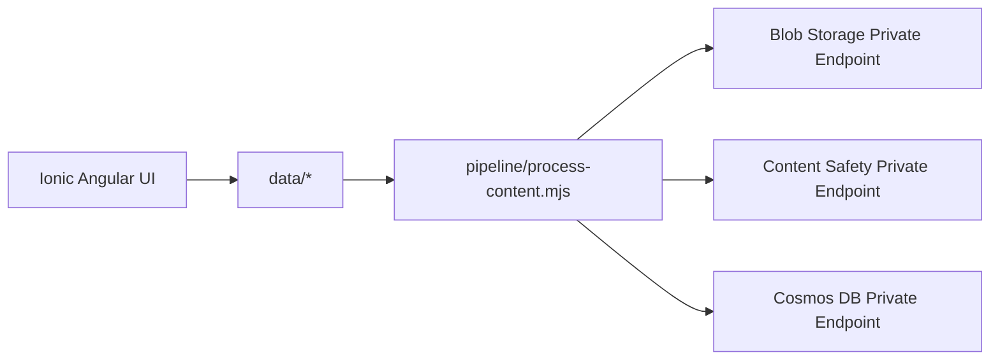

# AI Content Safety POC

Azure AI Content Safety proof of concept with generated test documents, private-network Azure processing pipeline, and Ionic + Angular UI.

## Table of Contents
- [Project Description](#project-description)
- [Architecture](#architecture)
- [Folder Structure](#folder-structure)
- [Generated Data](#generated-data)
- [Deployed Azure Infrastructure](#deployed-azure-infrastructure)
- [Configuration](#configuration)
- [UI (Ionic + Angular + TypeScript)](#ui-ionic--angular--typescript)
- [UI Deployment](#ui-deployment)
- [UI Screenshot](#ui-screenshot)
- [Pipeline Execution](#pipeline-execution)
- [GitHub Actions Workflows](#github-actions-workflows)
- [Best Practices for Content Safety](#best-practices-for-content-safety)
- [References](#references)
- [License](#license)

## Project Description
This repository implements the requested end-to-end flow:
1. Generate 100 mixed-format files (`png`, `jpg`, `pdf`, `docx`, `ppt`) with 50 expected to fail content safety.
2. Keep all Azure resource IDs, endpoints, and network settings in `/config` files (no hardcoded production values).
3. Upload files to Azure Blob Storage through private endpoint.
4. Process file content through Azure AI Content Safety through private endpoint.
5. Store processing outputs in Cosmos DB through private endpoint.
6. Provide responsive UI pages for document browsing and grouped moderation results.

## Architecture
Architecture diagrams are in [`docs/architecture-diagram.md`](docs/architecture-diagram.md).



## Folder Structure
```text
.
├── .github/workflows/
├── config/
├── data/
├── docs/
├── pipeline/
├── ui/
├── LICENSE
└── README.md
```

## Generated Data
- 100 mixed-format test files have been generated in `data/` folder:
  - 20 PNG images
  - 20 JPG images
  - 20 PDF documents
  - 20 DOCX documents
  - 20 PPT presentations
- Manifest file `data/manifest.json` tracks all files with expected moderation outcomes
- Exactly 50 files are marked as expected to fail content safety checks

## Deployed Azure Infrastructure
All resources are deployed in resource group **ai-myaacoub**:

| Resource | Name | Type |
|----------|------|------|
| **Blob Storage** | aistoragemyaacoub | Container: content-safety-documents |
| **Cosmos DB** | cosmos-ai-poc | Database: contentSafetyDb, Container: contentSafetyResults |
| **Content Safety** | 001-ai-poc | Cognitive Services (Private Endpoint) |
| **Web App** | ai-content-safety-ui | App Service (B1 Basic tier) |
| **App Service Plan** | ASP-aimyaacoub-87dc | Basic tier, West US 2 |

All services are configured for private endpoint access.

## Configuration
- Azure resource configuration: `config/azure-resources.json`
- Pipeline settings: `config/pipeline-settings.json`
- Cosmos DB throughput: Shared (400 RU/s limit)

## UI (Ionic + Angular + TypeScript)
The UI lives in `ui/` and includes:
- **Documents page**
  - Paginated document list
  - Drill-through preview before processing
  - Process selected/current-page docs
- **Results page**
  - KPI cards
  - Grouped moderation categories
  - Side-by-side document/result detail
- **Branding**
  - Microsoft logo in header
  - Footer with Michael Yaacoub, GitHub, and LinkedIn links

Responsive layouts are implemented for web, tablet, and mobile through Ionic grid and media queries.

## UI Deployment
The UI has been deployed to Azure App Service and is accessible at:
- **URL**: https://ai-content-safety-ui.azurewebsites.net
- **Resource Group**: ai-myaacoub
- **App Service Plan**: ASP-aimyaacoub-87dc (B1 Basic tier)

## UI Screenshot


## Pipeline Execution
```bash
# Root dependencies
npm ci

# UI
npm run ui:build
npm run ui:test

# Content safety processing
npm run pipeline:process
```

## GitHub Actions Workflows
- `ui-ci.yml`: triggers only when `ui/**` changes.
- `ui-deploy.yml`: builds UI, packages `ui/dist/ui/browser` contents, and deploys to `ai-content-safety-ui` App Service on pushes to `main`.
  - Uses Microsoft Entra app registration with GitHub OIDC (`azure/login`) and Azure CLI deploy (no publish profile).
  - Required repo secrets:
    - `AZURE_CLIENT_ID`
    - `AZURE_TENANT_ID`
    - `AZURE_SUBSCRIPTION_ID`
    - `AZURE_WEBAPP_NAME`
    - `AZURE_WEBAPP_RESOURCE_GROUP`
- `pipeline-validate.yml`: triggers only when `pipeline/**`, `config/**`, `data/**`, or root pipeline package files change.
- Docs/README-only edits do not match either workflow path filters.

### App Registration Setup Steps (UI Deploy)
The repository is configured to deploy with OIDC app registration authentication.

1. Create an Entra app registration (or reuse an existing one).
2. Create a service principal for that app.
3. Add a federated credential with:
   - Issuer: `https://token.actions.githubusercontent.com`
   - Subject: `repo:csdmichael/AI-Content-Safety-POC:ref:refs/heads/main`
   - Audience: `api://AzureADTokenExchange`
4. Assign least-privilege role on the target Web App scope:
   - Role: `Website Contributor`
   - Scope: `/subscriptions/86b37969-9445-49cf-b03f-d8866235171c/resourceGroups/ai-myaacoub/providers/Microsoft.Web/sites/ai-content-safety-ui`
5. Create GitHub Actions secrets listed above.

### Auto-Provisioned for This Repository
The following were created automatically:
- App registration: `ai-content-safety-ui-gha-oidc`
- Federated credential: `github-main-ui-deploy`
- Role assignment: `Website Contributor` on `ai-content-safety-ui`
- GitHub secrets:
  - `AZURE_CLIENT_ID`
  - `AZURE_TENANT_ID`
  - `AZURE_SUBSCRIPTION_ID`
  - `AZURE_WEBAPP_NAME`
  - `AZURE_WEBAPP_RESOURCE_GROUP`

## Best Practices for Content Safety
- Use private endpoints for storage, moderation APIs, and result databases.
- Keep thresholds and resource identifiers in configuration files.
- Never commit API keys or service secrets.
- Track expected-vs-actual moderation outcomes for calibration.
- Log moderation decisions with timestamps and category severities.

## References
- [Azure AI Content Safety documentation](https://learn.microsoft.com/azure/ai-services/content-safety/)
- [Quickstart: Analyze text](https://learn.microsoft.com/azure/ai-services/content-safety/quickstart-text)
- [Azure Blob Storage private endpoints](https://learn.microsoft.com/azure/storage/common/storage-private-endpoints)
- [Azure Cosmos DB private endpoints](https://learn.microsoft.com/azure/cosmos-db/how-to-configure-private-endpoints)

## License
See [LICENSE](LICENSE).
