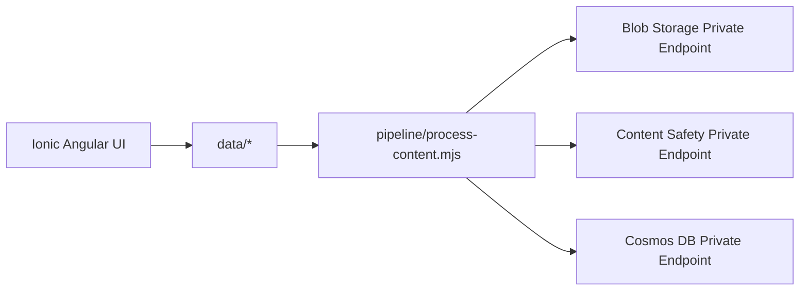

# AI Content Safety POC

Azure AI Content Safety proof of concept with generated test documents, private-network Azure processing pipeline, and Ionic + Angular UI.

## Table of Contents
- [Project Description](#project-description)
- [Architecture](#architecture)
- [Folder Structure](#folder-structure)
- [Generated Data](#generated-data)
- [Configuration](#configuration)
- [UI (Ionic + Angular + TypeScript)](#ui-ionic--angular--typescript)
- [UI Screenshot](#ui-screenshot)
- [Pipeline Execution](#pipeline-execution)
- [GitHub Actions Workflows](#github-actions-workflows)
- [Best Practices for Content Safety](#best-practices-for-content-safety)
- [References](#references)
- [License](#license)

## Project Description
This repository implements the requested end-to-end flow:
1. Generate 100 mixed-format files (`png`, `jpg`, `pdf`, `docx`, `ppt`) with 50 expected to fail content safety.
2. Keep all Azure resource IDs, endpoints, and network settings in `/config` files (no hardcoded production values).
3. Upload files to Azure Blob Storage through private endpoint.
4. Process file content through Azure AI Content Safety through private endpoint.
5. Store processing outputs in Cosmos DB through private endpoint.
6. Provide responsive UI pages for document browsing and grouped moderation results.

## Architecture
Architecture diagrams are in [`docs/architecture-diagram.md`](docs/architecture-diagram.md).



## Folder Structure
```text
.
├── .github/workflows/
├── config/
├── data/
├── docs/
├── pipeline/
├── ui/
├── LICENSE
└── README.md
```

## Generated Data
- `data/manifest.json` tracks all generated files and expected moderation outcomes.
- 100 total files were generated:
  - 20 PNG
  - 20 JPG
  - 20 PDF
  - 20 DOCX
  - 20 PPT
- Exactly 50 are marked as expected moderation failures.

## Configuration
Copy template files and fill real values from resource group `ai-myaacoub`:
- `config/azure-resources.template.json -> config/azure-resources.json`
- `config/pipeline-settings.template.json -> config/pipeline-settings.json`

Also provide runtime secrets via environment variables (`CONTENT_SAFETY_KEY`, Azure identity variables).

## UI (Ionic + Angular + TypeScript)
The UI lives in `ui/` and includes:
- **Documents page**
  - Paginated document list
  - Drill-through preview before processing
  - Process selected/current-page docs
- **Results page**
  - KPI cards
  - Grouped moderation categories
  - Side-by-side document/result detail
- **Branding**
  - Microsoft logo in header
  - Footer with Michael Yaacoub, GitHub, and LinkedIn links

Responsive layouts are implemented for web, tablet, and mobile through Ionic grid and media queries.

## UI Screenshot


## Pipeline Execution
```bash
# Root dependencies
npm ci

# UI
npm run ui:build
npm run ui:test

# Content safety processing
npm run pipeline:process
```

## GitHub Actions Workflows
- `ui-ci.yml`: triggers only when `ui/**` changes.
- `pipeline-validate.yml`: triggers only when `pipeline/**`, `config/**`, `data/**`, or root pipeline package files change.
- Docs/README-only edits do not match either workflow path filters.

## Best Practices for Content Safety
- Use private endpoints for storage, moderation APIs, and result databases.
- Keep thresholds and resource identifiers in configuration files.
- Never commit API keys or service secrets.
- Track expected-vs-actual moderation outcomes for calibration.
- Log moderation decisions with timestamps and category severities.

## References
- [Azure AI Content Safety documentation](https://learn.microsoft.com/azure/ai-services/content-safety/)
- [Quickstart: Analyze text](https://learn.microsoft.com/azure/ai-services/content-safety/quickstart-text)
- [Azure Blob Storage private endpoints](https://learn.microsoft.com/azure/storage/common/storage-private-endpoints)
- [Azure Cosmos DB private endpoints](https://learn.microsoft.com/azure/cosmos-db/how-to-configure-private-endpoints)

## License
See [LICENSE](LICENSE).
