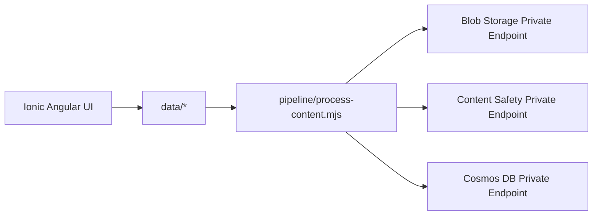

# AI Content Safety POC

Azure AI Content Safety proof of concept with generated test documents, private-network Azure processing pipeline, and Ionic + Angular UI.

## Table of Contents
- [Project Description](#project-description)
- [Architecture](#architecture)
- [Folder Structure](#folder-structure)
- [Generated Data](#generated-data)
- [Deployed Azure Infrastructure](#deployed-azure-infrastructure)
- [Setup & Configuration](#setup--configuration)
- [Configuration](#configuration)
- [UI (Ionic + Angular + TypeScript)](#ui-ionic--angular--typescript)
- [UI Deployment](#ui-deployment)
- [UI Screenshot](#ui-screenshot)
- [Pipeline Execution](#pipeline-execution)
- [GitHub Actions Workflows](#github-actions-workflows)
- [Best Practices for Content Safety](#best-practices-for-content-safety)
- [References](#references)
- [License](#license)

## Project Description
This repository implements the requested end-to-end flow:
1. Generate 100 mixed-format files (`png`, `jpg`, `pdf`, `docx`, `ppt`) with 50 expected to fail content safety.
2. Keep all Azure resource IDs, endpoints, and network settings in `/config` files (no hardcoded production values).
3. Upload files to Azure Blob Storage through private endpoint.
4. Process file content through Azure AI Content Safety through private endpoint.
5. Store processing outputs in Cosmos DB through private endpoint.
6. Provide responsive UI pages for document browsing and grouped moderation results.

## Architecture
Architecture diagrams are in [`docs/architecture-diagram.md`](docs/architecture-diagram.md).



## Folder Structure
```text
.
├── .github/workflows/
├── config/
├── data/
├── docs/
├── pipeline/
├── ui/
├── LICENSE
└── README.md
```

## Generated Data
- 100 mixed-format test files have been generated in `data/` folder:
  - 20 PNG images
  - 20 JPG images
  - 20 PDF documents
  - 20 DOCX documents
  - 20 PPT presentations
- Manifest file `data/manifest.json` tracks all files with expected moderation outcomes
- Exactly 50 files are marked as expected to fail content safety checks

## Deployed Azure Infrastructure
All resources are deployed in resource group **ai-myaacoub**:

| Resource | Name | Type | Details |
|----------|------|------|----------|
| **Blob Storage** | aistoragemyaacoub | Storage Account | Container: content-safety-documents |
| **Cosmos DB** | cosmos-ai-poc | NoSQL Database | Database: contentSafetyDb, Container: contentSafetyResults |
| **Content Safety** | 002-ai-poc-private | Cognitive Service | Private Endpoint: https://002-ai-poc-private.cognitiveservices.azure.com |
| **Web App** | ai-content-safety-ui | App Service | B1 Basic tier, West US 2 |
| **App Service Plan** | ASP-aimyaacoub-87dc | App Service Plan | Basic tier, West US 2 |

All services are configured for private endpoint access.

## Setup & Configuration

### Quick Start with Managed Identity

The pipeline uses **managed identity and RBAC** - no API keys needed:

```bash
# 1. Create service principal
SP=$(az ad sp create-for-rbac \
  --name "ai-content-safety-pipeline" \
  --role "Contributor" \
  --scopes "/subscriptions/86b37969-9445-49cf-b03f-d8866235171c/resourceGroups/ai-myaacoub")

CLIENT_ID=$(echo $SP | jq -r '.clientId')

# 2. Assign RBAC roles (Linux/macOS)
./setup.sh "$CLIENT_ID"

# OR for Windows
setup.bat %CLIENT_ID%
```

**For comprehensive setup instructions**, see [SETUP-MANAGED-IDENTITY.md](SETUP-MANAGED-IDENTITY.md).

## Configuration

### Resource Configuration Files
- Azure resource configuration: `config/azure-resources.json`
- Pipeline settings: `config/pipeline-settings.json`
- Cosmos DB throughput: Shared (400 RU/s limit)

### Azure AI Content Safety Service - Managed Identity Authentication

**Service Configuration**:
- **Service Name**: `ai-content-safety-myaacoub`
- **Private Endpoint**: `https://002-ai-poc-private.cognitiveservices.azure.com`
- **Region**: West US 2
- **API Version**: 2024-09-01
- **Authentication**: Managed Identity (Bearer token) - **No API keys needed**

**How It Works**:
1. Text content from documents is extracted and sent to the Content Safety service
2. The pipeline acquires a Bearer token using managed identity via `DefaultAzureCredential`
3. The service analyzes text for four harmful categories:
   - **Hate**: Content that expresses hostility or violence toward individuals based on protected characteristics
   - **Self-Harm**: Content that encourages or provides guidance on self-injury, suicide, or eating disorders
   - **Sexual**: Content that contains sexual references inappropriate for general audiences
   - **Violence**: Content that glorifies, promotes, or encourages violent acts
4. Each category receives a severity score (0-7)
5. Processing pipeline uses configurable threshold to make blocking decisions:
   - If max severity >= threshold (default: 4) → **blocked**
   - If max severity < threshold → **safe**
6. Results stored in Cosmos DB with timestamps and raw analysis data

**Authentication Setup - Managed Identity (No API Keys)**:

The pipeline uses `DefaultAzureCredential` which automatically tries:
1. Environment variables (AZURE_TENANT_ID, AZURE_CLIENT_ID, AZURE_CLIENT_SECRET)
2. Managed identity (if running in Azure)
3. Shared token cache (if logged in via `az login`)
4. Azure CLI credentials

**RBAC Role Assignments Required**:

For your service principal or managed identity, execute these commands:

```bash
# Store your client ID in a variable
CLIENT_ID="<your-client-id>"

# 1. Storage Blob Data Contributor (for Blob Storage)
az role assignment create \
  --role "Storage Blob Data Contributor" \
  --assignee "$CLIENT_ID" \
  --scope "/subscriptions/86b37969-9445-49cf-b03f-d8866235171c/resourceGroups/ai-myaacoub/providers/Microsoft.Storage/storageAccounts/aistoragemyaacoub"

# 2. Cognitive Services User (for Content Safety)
az role assignment create \
  --role "Cognitive Services User" \
  --assignee "$CLIENT_ID" \
  --scope "/subscriptions/86b37969-9445-49cf-b03f-d8866235171c/resourceGroups/ai-myaacoub/providers/Microsoft.CognitiveServices/accounts/ai-content-safety-myaacoub"

# 3. Cosmos DB Built-in Data Contributor (for Cosmos DB)
OBJECT_ID=$(az ad sp show --id "$CLIENT_ID" --query "id" -o tsv)
az cosmosdb sql role assignment create \
  --account-name cosmos-ai-poc \
  --resource-group ai-myaacoub \
  --role-definition-id 00000000-0000-0000-0000-000000000002 \
  --principal-id "$OBJECT_ID" \
  --scope "/"
```

## UI (Ionic + Angular + TypeScript)
The UI lives in `ui/` and includes:
- **Documents page**
  - Paginated document list
  - Drill-through preview before processing
  - Process selected/current-page docs
- **Results page**
  - KPI cards
  - Grouped moderation categories
  - Side-by-side document/result detail
- **Branding**
  - Microsoft logo in header
  - Footer with Michael Yaacoub, GitHub, and LinkedIn links

Responsive layouts are implemented for web, tablet, and mobile through Ionic grid and media queries.

## UI Deployment
The UI has been deployed to Azure App Service and is accessible at:
- **URL**: https://ai-content-safety-ui.azurewebsites.net
- **Resource Group**: ai-myaacoub
- **App Service Plan**: ASP-aimyaacoub-87dc (B1 Basic tier)

## UI Screenshot


## Pipeline Execution - Setup & Run with Managed Identity

### Quick Setup (One Command)

The project includes setup scripts to automatically configure all RBAC roles:

**For Linux/macOS:**
```bash
# 1. Create a service principal
SP=$(az ad sp create-for-rbac \
  --name "ai-content-safety-pipeline" \
  --role "Contributor" \
  --scopes "/subscriptions/86b37969-9445-49cf-b03f-d8866235171c/resourceGroups/ai-myaacoub")

CLIENT_ID=$(echo $SP | jq -r '.clientId')

# 2. Run setup script to assign RBAC roles
./setup.sh "$CLIENT_ID"
```

**For Windows:**
```bash
# 1. Create a service principal
az ad sp create-for-rbac ^
  --name "ai-content-safety-pipeline" ^
  --role "Contributor" ^
  --scopes "/subscriptions/86b37969-9445-49cf-b03f-d8866235171c/resourceGroups/ai-myaacoub"

# 2. Run setup batch file (replace with your CLIENT_ID)
setup.bat <client-id>
```

### Manual Setup (Step by Step)

See [config/README.md](config/README.md) for detailed manual RBAC commands.

### Run Pipeline

```bash
# 1. Copy and update configuration files
cp config/azure-resources.template.json config/azure-resources.json
cp config/pipeline-settings.template.json config/pipeline-settings.json

# 2. Set authentication environment variables
export AZURE_TENANT_ID="<your-tenant-id>"
export AZURE_CLIENT_ID="<your-client-id>"
export AZURE_CLIENT_SECRET="<your-client-secret>"

# OR use local Azure login (simpler for development)
az login
az account set --subscription 86b37969-9445-49cf-b03f-d8866235171c

# 3. Install dependencies
npm ci

# 4. Build and test UI (optional)
npm run ui:build
npm run ui:test

# 5. Run content safety pipeline
npm run pipeline:process
```

### Pipeline Setup Details

All Azure services use **managed identity authentication via private endpoints**:
- ✅ **No API keys** to manage or rotate
- ✅ **Private network** access only
- ✅ **RBAC-based** access control
- ✅ **Auditability** of all access

See [pipeline/README-managed-identity.md](pipeline/README-managed-identity.md) for comprehensive setup documentation.

## GitHub Actions Workflows
- `ui-ci.yml`: triggers only when `ui/**` changes.
- `ui-deploy.yml`: builds UI, packages `ui/dist/ui/browser` contents, and deploys to `ai-content-safety-ui` App Service on pushes to `main`.
  - Uses Microsoft Entra app registration with GitHub OIDC (`azure/login`) and Azure CLI deploy (no publish profile).
  - Required repo secrets:
    - `AZURE_CLIENT_ID`
    - `AZURE_TENANT_ID`
    - `AZURE_SUBSCRIPTION_ID`
    - `AZURE_WEBAPP_NAME`
    - `AZURE_WEBAPP_RESOURCE_GROUP`
- `pipeline-validate.yml`: triggers only when `pipeline/**`, `config/**`, `data/**`, or root pipeline package files change.
- Docs/README-only edits do not match either workflow path filters.

### App Registration Setup Steps (UI Deploy)
The repository is configured to deploy with OIDC app registration authentication.

1. Create an Entra app registration (or reuse an existing one).
2. Create a service principal for that app.
3. Add a federated credential with:
   - Issuer: `https://token.actions.githubusercontent.com`
   - Subject: `repo:csdmichael/AI-Content-Safety-POC:ref:refs/heads/main`
   - Audience: `api://AzureADTokenExchange`
4. Assign least-privilege role on the target Web App scope:
   - Role: `Website Contributor`
   - Scope: `/subscriptions/86b37969-9445-49cf-b03f-d8866235171c/resourceGroups/ai-myaacoub/providers/Microsoft.Web/sites/ai-content-safety-ui`
5. Create GitHub Actions secrets listed above.

### Auto-Provisioned for This Repository
The following were created automatically:
- App registration: `ai-content-safety-ui-gha-oidc`
- Federated credential: `github-main-ui-deploy`
- Role assignment: `Website Contributor` on `ai-content-safety-ui`
- GitHub secrets:
  - `AZURE_CLIENT_ID`
  - `AZURE_TENANT_ID`
  - `AZURE_SUBSCRIPTION_ID`
  - `AZURE_WEBAPP_NAME`
  - `AZURE_WEBAPP_RESOURCE_GROUP`

## Best Practices for Content Safety
- Use private endpoints for storage, moderation APIs, and result databases.
- Keep thresholds and resource identifiers in configuration files.
- Never commit API keys or service secrets.
- Track expected-vs-actual moderation outcomes for calibration.
- Log moderation decisions with timestamps and category severities.

## References
- [Azure AI Content Safety documentation](https://learn.microsoft.com/azure/ai-services/content-safety/)
- [Quickstart: Analyze text](https://learn.microsoft.com/azure/ai-services/content-safety/quickstart-text)
- [Azure Blob Storage private endpoints](https://learn.microsoft.com/azure/storage/common/storage-private-endpoints)
- [Azure Cosmos DB private endpoints](https://learn.microsoft.com/azure/cosmos-db/how-to-configure-private-endpoints)

## License
See [LICENSE](LICENSE).
