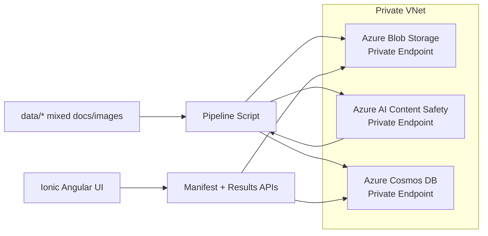
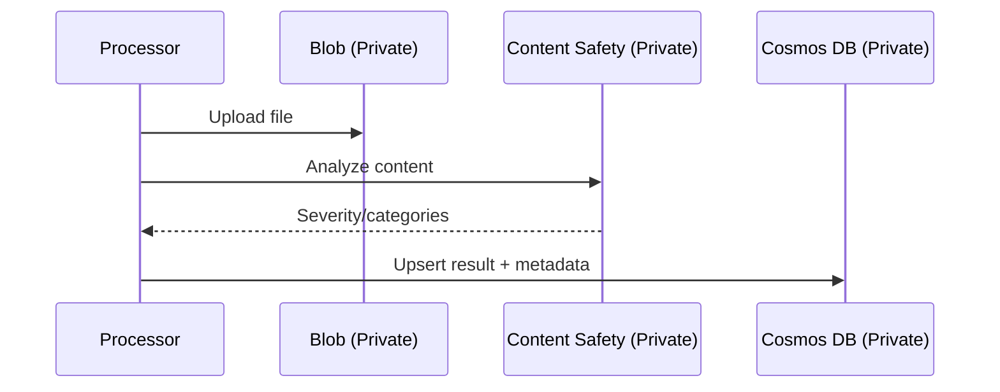

# Architecture Diagram

```mermaid
flowchart LR
  A[data/* mixed docs/images] --> B[Pipeline Script]
  B --> C[Azure Blob Storage\nPrivate Endpoint]
  B --> D[Azure AI Content Safety\nPrivate Endpoint]
  D --> B
  B --> E[Azure Cosmos DB\nPrivate Endpoint]

  subgraph PrivateVNet[Private VNet]
    C
    D
    E
  end

  U[Ionic Angular UI] --> F[Manifest + Results APIs]
  F --> E
  F --> C
```

```mermaid
sequenceDiagram
  participant P as Processor
  participant B as Blob (Private)
  participant S as Content Safety (Private)
  participant C as Cosmos DB (Private)

  P->>B: Upload file
  P->>S: Analyze content
  S-->>P: Severity/categories
  P->>C: Upsert result + metadata
```
